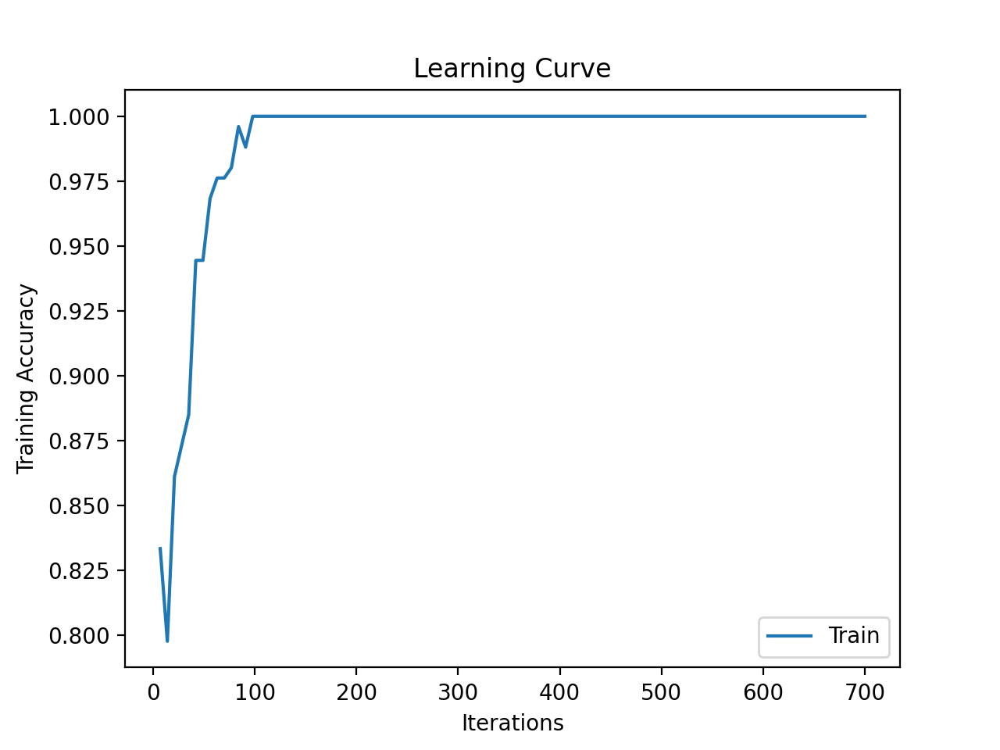
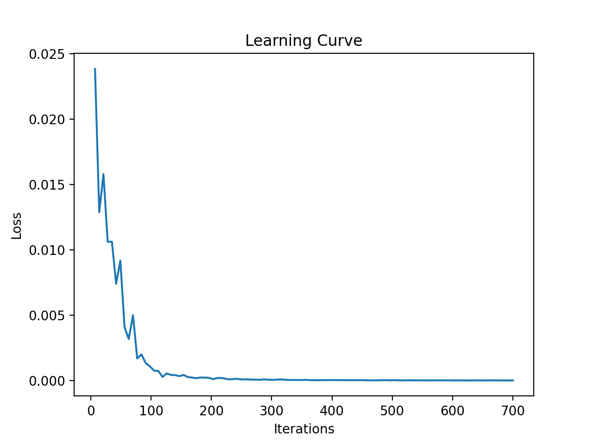

# Transfer Learning from AlexNet to identify Brain Tumor
<div style="padding-left:10px; padding-right:15px;">An MLP (Multi-Layer-Perceptron) attached to a pre-trained AlexNet weights, to identify brain tumor.</div>
<hr>

### Table of Contents
1. [Overview](#Overview)
3. [Model Training](#model-training)
3. [How To Use It](#how-to-use-it)
4. [What to do after training?](#what-to-do-after-training?)

 
### Overview:
This is a MLP-CNN model that allows users to do fundamental CNN analysis:
- Provides the users the ability to prepare data for the ML model
- It provides users the ability to create complex mini-batches of large data.
- Allows users to train model, plot graphs and saves checkpoint for early stopping.

### Model Training:
The MLP-CNN is trained on dataset provided inside `/dataset/`. It contains:
- `no`: contains images of brain without tumor.
- `yes`: contains images of rain with tumor.

The model was trained on 100 epochs with batches of 32 and a learning rate of 0.001. The training accuracy is shown in the graph below:


The loss graph is shown below:


### How To Use It
There are 3 major steps that needs to be done before MLP-CNN is ready to use. These are as follows:

<ol>
<li>
First you need to create a python virtual environment and install all the required pip libraries. You can do it as follows:

```sh
virtualenv venv
source ./venv/bin/activate

pip install -r requirements.txt
```
</li>

<li>
Now you need to specify the location for your training, testing and validation dataset. You need to change the following variables:

- `dataPreparation.py`  : train_path
- `dataPreparation.py`  : valid_path
- `dataPreparation.py`  : test_path

</li>

<li>
Change the number of distinct classes the images have. You can do that by changing the following variables:

- `models.py`: NumberOfUniqueClasses
</li>
</ol>

Now you are ready to train your MLP-CNN model. Just run `python train.py` to train the model.

### What to do after training?
What to do after you have trained your model? well you can use `model-loader.py` to run your save model on a test set. You need to change the following variables:
- `img_path`: Location of the test set.
- `model_data = torch.load('changeMe')`: Location of the CNN model.

